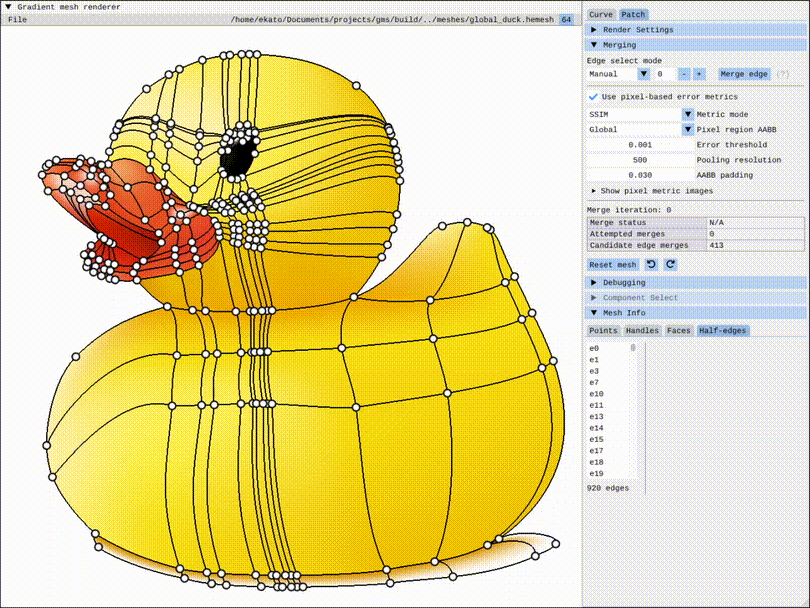

#### Gradient mesh simplification
This is a tool to test gradient mesh simplification driven by pixel-based (image) metrics.

#### Building
This application requires C++20, OpenGL 4.3, and GLFW. There are also several external libraries used and added as git submodules, including:
- `glad`: for [Glad](https://glad.dav1d.de/)
- `glm`: for the [OpenGL Mathematics library](https://github.com/g-truc/glm/tree/master/glm)
- `imgui`: for the [Dear ImGui library](https://github.com/ocornut/imgui), as well as [imgui-filebrowser](https://github.com/AirGuanZ/imgui-filebrowser) (just a header file stored in the root of `imgui`)
- `stb`: for the [stb_image_write header file](https://github.com/nothings/stb/blob/master/stb_image_write.h)
- `ssim`: for  romigrou's [SSIM implementation](https://github.com/romigrou/ssim)
- `flip`: for  [NVIDIA's FLIP](https://github.com/NVlabs/flip/tree/main/cpp)

#### UI controls

|  | Controls |
| ----------- | ----------- |
| Zoom in/out      | Mouse scroll forward/backward or +/- keys       |
| Translate x/y      | Move mouse while holding down the middle mouse button |